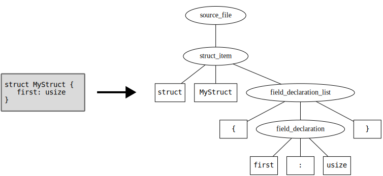
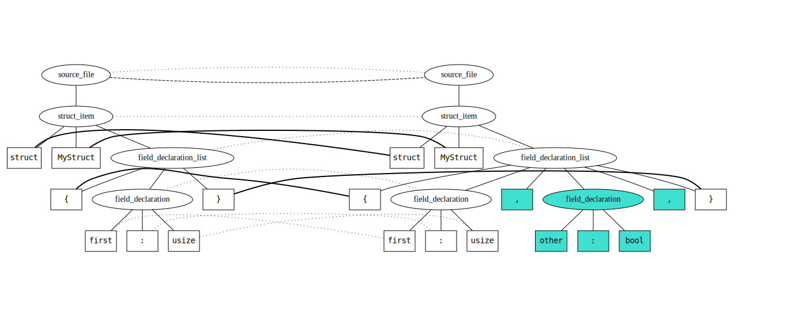
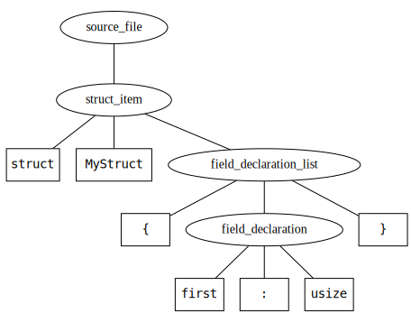
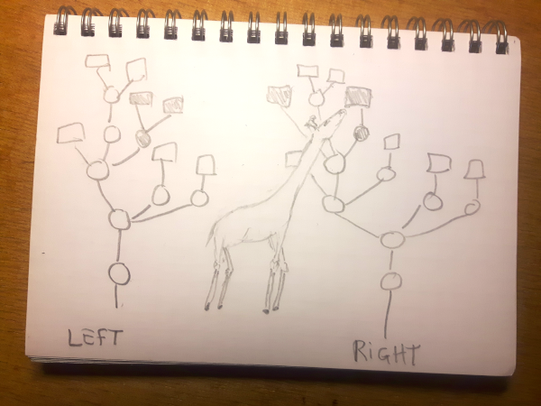

# Architecture

Mergiraf broadly follows the architecture of [spork](https://github.com/ASSERT-KTH/spork), which is itself documented in [the corresponding article](https://arxiv.org/abs/2202.05329). Without requiring familiarity with that article, this page gives an overview of the different steps involved in merging files:
* [Parsing](#parsing) the base, left and right revisions with tree-sitter
* Creating [matchings](#matching) between all three pairs of syntax trees with the GumTree classic algorithm
* Creating a [class mapping](#class-mapping) out of the three matchings
* [Converting](#converting-to-pcs-triples) trees to PCS triples
* [Merging](#merging-pcs-triples) the set of PCS triples together
* [Building](#building-the-merged-result) the merged tree out of the PCS triples
* [Checking for delete/modify conflicts](#checking-for-deletemodify-conflicts)
* [Checking for duplicate signatures](#checking-for-duplicate-signatures) and marking such as conflicts
* [Rendering](#rendering) the merged tree to a text file with conflicts

Those steps represent the core of the structured merge algorithm in Mergiraf. This algorithm is used together with traditional line-based merging to implement the [fast mode](#fast-mode). Beyond the introduction of this fast mode, [Mergiraf differs from Spork in other important ways](related-work.md#overview-of-the-differences-with-spork).

## Steps of structured merging

### Parsing

Before parsing, line endings are normalized to line-feed characters (if another style of line ending was used, it will be restored at the very end on the merged result).
The contents of all three revisions (base, left and right) are then parsed with tree-sitter after detecting their common language based on the file extension.
After parsing, leaf nodes which span over multiple lines (such as multi-line comments or string literals) are split into lines, making up new subnodes. This ensures that they are not treated as atomic tokens but are instead merged line-by-line later on.

If a parsing error occurs in any of the three revisions, the algorithm aborts and falls back on line-based merging.

[](./parsing.svg)

### Matching

A matching between two syntax trees is a one-to-one correspondence between nodes of the trees. This includes both internal nodes and leaves.
Two nodes are matched when they are similar enough to assume that they correspond to the same content.
For instance, two subtrees that are isomorphic (meaning that they have the exact same structure, including the same content in their leaves) are likely to correspond to the same content which is unchanged in both revisions.

For instance, consider the following two revisions:
<div class="conflict">
<div class="left">
<div class="rev">Base</div>

```rust
struct MyStruct {
    first: usize
}
```

</div>
<div class="base">
<div class="rev">Left</div>

```rust
struct MyStruct {
    first: usize,
    other: bool,
}
```

</div>
</div>

Their syntax trees are matched as follows, with the added content in the "Left" revision not matched (and highlighted below):

[](./matching.svg)

The heuristic we use to produce matchings between syntax trees is the GumTree classic algorithm. For a detailed explanation of the algorithm
we recommend reading [the associated paper](https://hal.science/hal-01054552), but we give here a high-level summary. The algorithm works in two phases:
* match all pairs of isomorphic subtrees on both sides, assuming they are sufficiently deep and that they are unique within the revision where they appear. This phase is done in a top-down fashion, meaning that larger subtrees get matched first.
* infer additional matches by inspecting at the ancestors of already matched pairs and matching them if they are deemed similar enough. Similarity is measured by looking at the proportion of their common matched descendants. This phase is done in a
  bottom-up fashion, by inferring additional matches from the leaves first.

This algorithm is used to match all three pairs of revisions:
* base and left
* base and right
* left and right

When the base revision is involved, the matching heuristic matches additional elements, first by using less conservative parameters for the heurstic above, but also by using the tree edit distance algorithm to infer additional matches between descendants of nodes matched in the second phase.

The reason for using a different heuristic to match the left and right revisions is that any false positive in this matching can have quite detrimental effects on the merged result. Furthermore, this matching only plays a role when the left and right revisions happen to do similar changes on top of the base revision, which is relatively rare in practice.

### Class-mapping

Once all pairs of revisions are matched, we create a notion of node identity across all three revisions by considering equivalence classes of the union of all matchings. In other words, if any two nodes are matched, they are considered to be the same. Two
nodes are also considered the same if they are both matched to a common node in the third revision.

To simplify the rest of the algorithm, we pick a so-called "leader" among mutually matched nodes, which is used to represent the group. This leader is picked by preference over revisions: the base has priority over the left, which has priority over the right.

The class-mapping retains the correspondence between leaders and their class members, making it possible to look up which node corresponds to a leader in a given revision.

### Converting to PCS triples

Each tree is then encoded as a set of "Parent-Child-Successor" (PCS) triples.
A triple `(p,c,s)` means that node `p` is the parent of both `c` and `s`, and that `s` immediately follows `c` in the list of children of `p`.
Each node is represented by its leader in its equivalence class. Sentinel nodes are added at the beginning and end of each child list, denoted by `⊣` and `⊢` respectively. Additionally, a virtual root `⊥` is added, also to identify the original root in the
tree.

For instance, consider the following tree.

[](./tree.svg)

Assuming those nodes readily represent the leaders in their equivalence classes, such a tree will be converted to a set of PCS triples as follows:
```
(⊥, ⊣, source_file)
(⊥, source_file, ⊢)
(source_file, ⊣, struct_item)
(source_file, struct_item, ⊢)
(struct_item, ⊣, "struct")
(struct_item, "struct", "MyStruct")
(struct_item, "MyStruct", field_declaration_list)
(struct_item, field_declaration_list, ⊢)
(field_declaration_list, ⊣, "{")
(field_declaration_list, "{", field_declaration)
(field_declaration_list, field_declaration, "}")
(field_declaration_list, "}", ⊢)
(field_declaration, ⊣, "first")
(field_declaration, "first", ":")
(field_declaration, ":", "usize")
(field_declaration, "usize", ⊢)
```

A set of PCS triples is called a "changeset".

### Merging PCS triples

Once each revision has been mapped to a changeset, we merge all of the changesets together. To do so, we tag each triple with the revision it came from, obtaining a quadruplet such as `(field_declaration, "usize", ⊢, L)`.

By taking the union of all sets of quadruplets, we create a set of triples which is potentially inconsistent: for instance, it is possible to have quadruplets `(p,c,s1,B)` and `(p,c,s2,L)`, if the successor of `c` is not the same in the base and left revision.

We eliminate all quadruplets coming from the base revision which are inconsistent with a triple from the left or right revision. Two quadruplets are inconsistent when:
* they have the same parent and child component, but the successor differs
* they have the same parent and successor component, but the child (predecessor) differs
* one of the child and successor of the first is equal to one of the child and successor of the second, but the parents are different

This pass eliminates some inconsistencies in the set, but not all of them. The remaining ones are handled during the construction of the merged result, where they might be turned into conflicts or resolved on the fly.

### Building the merged result

The creation of the merge output is done by attempting to reconstruct a tree out of the merged changesets. It is done recursively, starting from the virtual root,
and attempting to read a consistent list of children from the PCS triples.

At this stage, different sorts of inconsistencies can be detected. [The article about Spork](https://arxiv.org/abs/2202.05329) offers a good overview of those different types in section 3.4.

In many of those situations (such as when conflicting deletions happen on both sides), we simply give up by falling back on a local line-based merge. This is done by obtaining the original source of the parent being reconstructed in all three revisions and merging those using the standard diff3 algorithm.

When the parent node being reconstructed is known to be a commutative parent, we are able to solve more types of conflicts without falling back on line-based merge.
When such a conflict happens, we extract the lists of children on all three revisions, and merge them by:
* computing the set of children that the right revision deletes (compared to the base revision)
* computing the set of children that the right revision adds
* finally, taking the list of children on the left, removing those that the right revision removes and appending the ones that it adds

A merged tree is therefore made of the following types of nodes:
* `ExactTree`: A node that is identical to an original node in the AST of some revision(s). The set of revisions which it can be printed from is a subset of the set of revisions present in this equivalence class (since the tree may not be isomorphic in all such revisions)
* `Conflict`: A node which represents a conflict, with contents for all three revisions. Those contents are nodes from the ASTs of the original revisions.
* `LineBasedMerge`: A node which contains text obtained by running classic line-based merging on the sources of an AST node on the three revisions. The original AST node equivalence class is retained.
* `MixedTree`: An internal node of the merged tree, containing a list of other nodes as children
* `CommutativeChildSeparator`: A piece of text which does not belong to any of the original revisions. It is inserted between children of a commutative parent if they need separating. 

### Checking for delete/modify conflicts

Sometimes, one revision makes changes to an element that the other revision deletes:

<div class="conflict">
<div class="left">
<div class="rev">Left</div>

```rust
dismountTire(&wheel);
applyGlueAroundPuncture(&wheel.innerTube);
wait(Duration::minutes(5)); // better wait a bit longer
applyPatch(&wheel.innerTube);
```

</div>
<div class="base">
<div class="rev">Base</div>

```rust
dismountTire(&wheel);
applyGlueAroundPuncture(&wheel.innerTube);
wait(Duration::minutes(2));
applyPatch(&wheel.innerTube);
```

</div>
<div class="right">
<div class="rev">Right</div>

```rust
dismountTire(&wheel);
wheel.innerTube = InnerTube::new(); // otherwise I'll be late to pick up the kids
```

</div>
</div>

In such a case, reconstructing the tree out of PCS triples will just give the right revision back, regardless of the fact that the left revision made some changes to elements that the right revision deleted.
While this could be the right thing to do in this case, in general we want to avoid this behaviour, because it could be that the deleted elements have actually been moved elsewhere (possibly in a different file), so the user should know that they need to transfer such changes there.
The lack of conflict in this case is a [known issue](https://github.com/ASSERT-KTH/spork/issues/529) of the 3DM merge algorithm.

To make sure that we do emit a conflict, we keep track of deleted nodes as we build the merged tree out of the PCS triples.
At the end of the algorithm, we check if any of those nodes has been modified in the other revision.
If that is the case, we try to compute a covering of the changes inside the element (let's call it `E`). This means finding a set of descendants `D` of the element, such that:
* all descendants in `D` are present in the deleting revision (meaning that they have been moved elsewhere in the file)
* the changes to `E` in the modifying revision are all happening within the subtrees rooted in `D`
If we are able to find such a covering, then we conclude that all changes inside `E` are reflected in the merged file, so we don't need to flag this as a conflict.
Otherwise, we modify the merged tree to insert a conflict (by computing a line-based merge for the parent of `E`).

### Checking for duplicate signatures

It is possible that the merged tree contains elements with duplicate signatures. This can happen when the two revisions insert elements with identical signatures without them being in conflicting locations, or if somehow applying changes from both sides made two existing elements get the same signature.

We make one pass over the merged tree and for each commutative parent we encounter, we check if any children have identical signatures.
If this is the case, we group them together at the location of the first such element and replace them by a conflict.

### Rendering

The merged tree then needs to be converted to a text file. This comes with essentially two challenges:
1. Which **whitespace** to insert between various parts of the merged tree? In most cases, whitespace is not syntactically significant and is therefore not represented in the AST. However, displaying appropriate whitespace is crucial to make sure the merged
  output is faithful to the original revisions.
2. How to render **conflicts**? Because Mergiraf is able to generate granular conflicts, for instance around a binary operator or a single argument of a function call, the boundaries of those conflicts may not match line boundaries. However, the traditional merge conflict markers used by Git (and relied on by many other tools) assume that conflicts are line-based.

The first step of rendering is to convert the merged tree to a stream, consisting of a mixture of successfully merged strings and conflicts (containing all three conflict sides). During this step, whitespace between those tokens is computed by imitating
the whitespace from the original revisions, as well as adapting the indentation in case some sections of the source code changed indentation levels.

Then, this stream is further processed to render the conflicts. There are two modes to do so:
* the **default mode**, which positions conflict markers around the lines containing granular conflicts (giving an experience similar to Git's own behaviour)
* the **compact mode**, which attempts to display smaller conflicts, potentially by introducing conflict markers inside a line (splitting it onto multiple lines). While this makes for smaller conflicts, it interferes with the formatting of the merged
  tree. This mode can be enabled with `--compact`.

## Fast mode

By design, Mergiraf first attempts a line-based merge of its input files before running the more costly structured merge algorithm described above.
If the line-based merge succeeds without any conflicts, it is returned as merge output.

When conflicts are present in the line-based merge, we do not discard this output either. Instead, we reconstruct fictional base, left and right revisions from the merged file, by selecting each part of the conflicts appropriately. Those fictional
revisions are generally not identical to the original revisions we started with, as it is possible that some of the changes got merged without conflicts.
Because those fictional revisions come from the same merged file, we are able to pre-compute matchings between all three pairs of revisions, by matching any syntactical element whose extent lies exclusively in a merged area, without any conflicts. This
initial matching is fed into the tree matching algorithm, speeding it up significantly as many nodes are readily matched. The rest of the structured merging algorithm is then run unchanged.

This algorithm is also the basis of Mergiraf's [interactive mode](./usage.md#interactive-use-after-encountering-a-merge-conflict) which attempts to resolve conflicts solely based on a failed line-based merge, without access to the original revisions.

It is worth noting that some conflicts cannot be solved in the fast mode. This is primarily the case when [moving edited elements](./conflicts.md#moving-edited-elements).

<div style="text-align: center">

<p class="figurecaption"><strong>Figure 1:</strong> Early blueprint of the original architecture</p>
</div>


