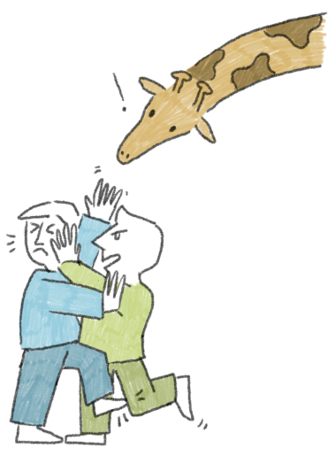
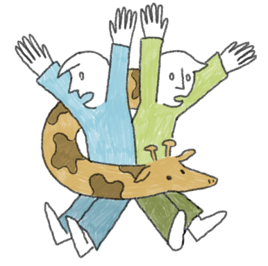
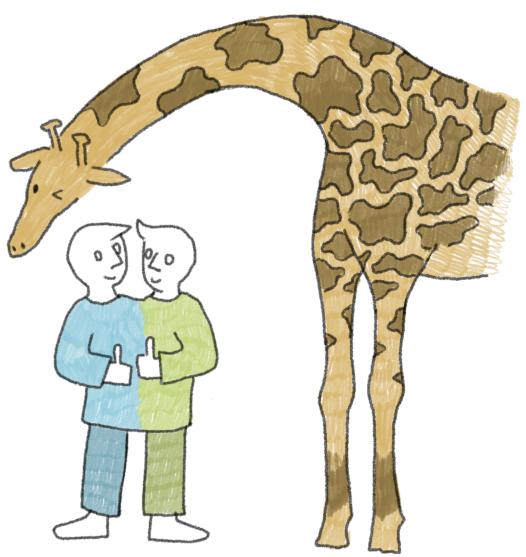

*Are you held back by conflicts? Then meet*

# Mergiraf

Mergiraf can solve [a wide range of Git merge conflicts](./conflicts.md). That's because it's aware of the trees in your files!
Thanks to [its understanding of your language](./languages.md), it can often reconcile the needs of both sides.

You can [teach Mergiraf a new language](./adding-a-language.md) in a completely declarative way. It's a nonviolent animal, so it prefers that over imperatives.

<h2 id="demo" style="margin-block-start: 1em">Demo</h2>

Configure Git to use Mergiraf instead of its default merge heuristics. This will enhance `git merge`, `revert`, `rebase`, `cherry-pick` and more.

You can also keep Git's original behaviour and manually invoke Mergiraf after encountering conflicts.

<strong>Figure 1:</strong> Two git users making inadequate use of <code>blame</code>, <code>push</code> and <code>pull</code> to resolve a conflict

## Ready to give it a try?

Head to the [installation](./installation.md) page and start merging nonviolently today!

## Aspirations

Mergiraf is designed with your needs in mind. Its goals are:

### Don't sweep conflicts under the rug

Syntax-aware merging heuristics can sometimes be a bit too optimistic in considering a conflict resolved. Mergiraf does its best to err on the side of caution and retain conflict markers in the file when encountering suspicious cases.

If it manages to resolve all conflicts on its own, it encourages you to review its mediation work via the `mergiraf review` command.
If a merge looks faulty, [you can report it easily](./usage.md#reporting-a-bad-merge).

### Be fast enough for interactive use

<strong>Figure 2:</strong> Mergiraf offers to mediate

Did you know that giraffes can run as fast as 60 kilometers per hour? Anyways. The operation of merging diverging versions of files happens routinely when working on a code base, often without you noticing as long as there aren't any conflicts. So Mergiraf tries to be quick so as not to interrupt you in your tasks.

### Be open to other methods

In many cases, line-based merging works just great and there is no need for tree-munging business. If a line-based merge is conflict-free, then Mergiraf just returns that merge (which is very quick).
One exception to this rule is [when line-based merging creates duplicate keys](./conflicts.md#line-based-merges). In such a case, Mergiraf does a bit more work to resolve the issue or highlight it to you with conflict markers.

<strong>Figure 3:</strong> Harmony and peace reign on Earth

Illustrations by [Freya F-T](https://freyaft.com), [CC-BY 4.0](https://creativecommons.org/licenses/by/4.0/).

